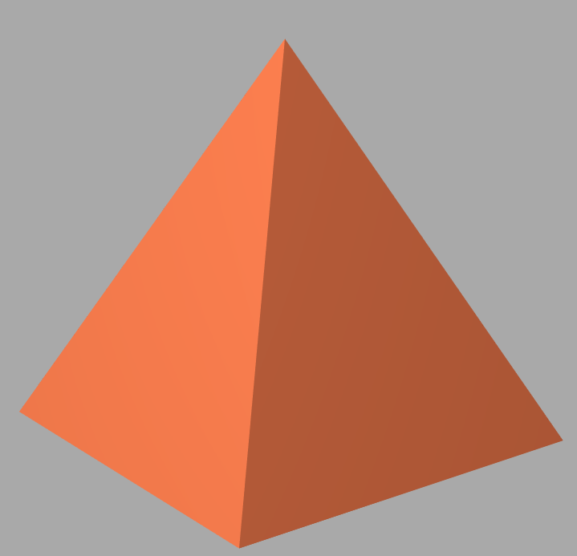

# Задания по курсу "Компьютерная графика" УрФУ
## C#, OpenTK, GLSL
### Assignment6 - Разные 3д фигуры, затенение Фонга, 3D модель с текстурами
Скриншоты: 

### Assignment8 - Трассировка путей в шейдере на GLSL
Скриншоты:

